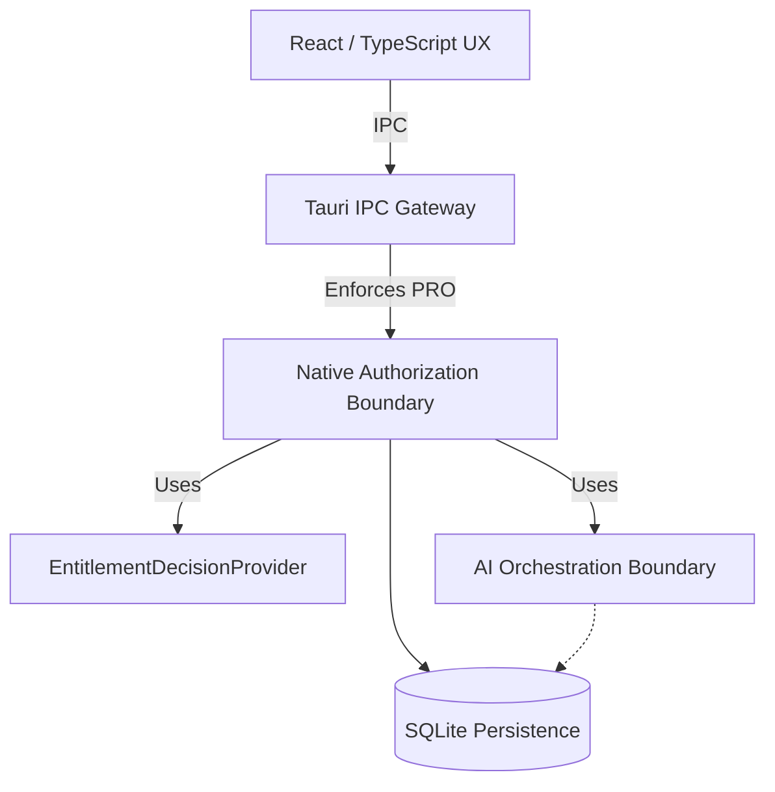
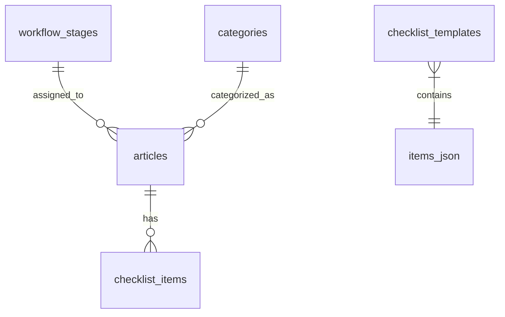
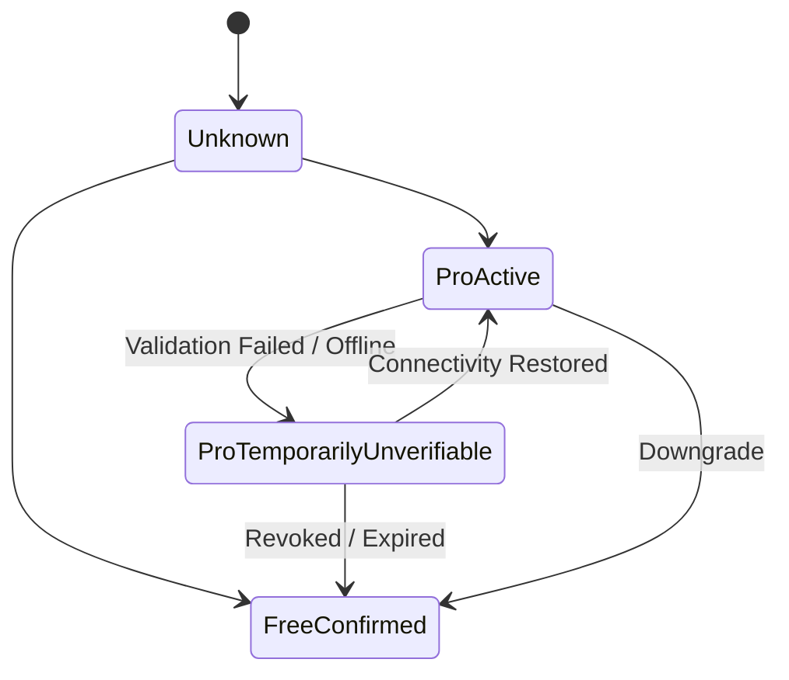
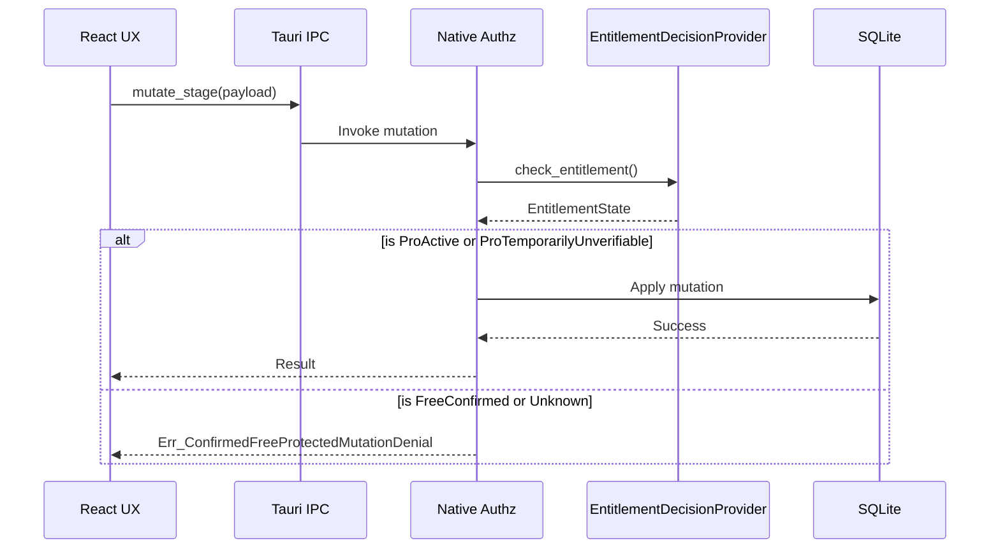

# Software Design Document: Phase 6.4 - PRO Workflow Customization

## 1. Status
PHASE 6.4 — SOFTWARE DESIGN — DRAFT FOR HUMAN REVIEW

## 2. Introduction and Context
This SDD details the software architecture for Phase 6.4 PRO Workflow Customization. Based on the Phase 6.4 PRD and the architectural decisions defined in ADR-008, ADR-009, ADR-010, and ADR-011, this document specifies the implementation of customizable workflow stages, custom categories, and reusable checklist templates while adhering to local-first principles.

It explicitly maintains the existing Retranca OS stack: React/TypeScript (Frontend), Tauri/Rust (Backend IPC Gateway), and local SQLite persistence. No cloud dependencies, generic authentication providers, or external databases are introduced.

## 3. Current State Architecture & Impacted Modules
The current Retranca OS architecture represents `ArticleStatus` and `CategoryTag` as closed string literal unions in TypeScript (`types/editorial.ts`).

Current TypeScript representations:
`ArticleStatus`: `'ideia' | 'pesquisa' | 'escrita' | 'revisao' | 'publicado'`
`CategoryTag`: `'IA' | 'Acessibilidade' | 'Inclusão' | 'SEO' | 'Docs' | 'Blog' | 'Social' | 'Linguagem Simples'`

The current SQLite `articles` columns include `status` and `categoryTag`.

Current article checklist persistence is ALREADY relational in the `checklist_items` table (columns: `id`, `articleId`, `label`, `completed`, `category`).

**Impacted Modules:**
- **Persistence (SQLite):** New tables for `workflow_stages`, `categories`, and `checklist_templates`. Schema modifications to `articles`.
- **Backend (Rust):** New DTOs and IPC handlers for managing PRO entities. Updates to `EditorialContext` generation and the AI orchestrator's evidence validation.
- **Frontend (TypeScript):** UI/UX for workflow and category management. Updates to Kanban, List, and Stats views to consume dynamic entities. Updates to AI recommendation logic.
- **Entitlement Boundary:** New Rust-side entitlement verification and enforcement layer (Tauri native boundary) to gate PRO mutations.

## 4. Dynamic Workflow-Stage Domain Model
Following ADR-009, workflow stages are modeled as dynamic entities. This SDD explicitly selects UUIDs as the stable identity format for these entities, as they are appropriate for stable local identity generation without centralized coordination, ensuring they survive renames and reordering. Exact UUID generation library/algorithm details will be formalized in the Spec.

**Model:**
- `id` (UUID): Stable stage identity.
- `display_name` (String): The user-facing name.
- `order_index` (Integer): Determines left-to-right Kanban ordering and sequential flow.
- `semantic_classification` (Enum, Optional): Semantic mapping used for UI AI recommendation.
- `is_active` (Boolean): Supports safe removal.

**Business Rules:**
- **Minimum one stage:** The system rejects any operation resulting in zero active stages.
- **Safe stage removal:** A stage cannot be destructively removed while unresolved article references would be orphaned or silently remapped. Resolution may include deliberate reassignment chosen by the user.

## 5. Workflow Semantic Classification
Semantic classifications preserve compatibility with the current five statuses and influence TypeScript RECOMMENDED UX only.
Custom stages may have one optional semantic classification, or no classification.

**Mapping:**
- `ideia` -> `IDEA`
- `pesquisa` -> `RESEARCH`
- `escrita` -> `DRAFTING`
- `revisao` -> `REVIEW`
- `publicado` -> `PUBLISHED`

**Invariant preserved:** *status recommends; validated evidence determines action availability.*
Rust evidence prerequisite validation MUST NOT depend on stage display name or semantic classification. There is NO one-to-one mapping between a custom stage and an AI action.

## 6. Free Default Workflow vs Customized Preserved State
A fresh/default Free configuration starts with the standard five stages, which represent the standard default baseline.

While PRO is valid, those workflow stages may be renamed/reordered, and additional stages may be added/removed subject to safety rules.
If the user later downgrades:
- Custom workflow configuration is NOT reset.
- Stages are NOT silently remapped back to defaults.
- Existing configuration is preserved.
- Ordinary editorial work using that existing workflow remains safe.
- Protected new customization mutations follow the approved entitlement policy.

## 7. Standard Categories vs Custom PRO Categories
The system distinguishes the standard Free category set from PRO-created custom categories using a provenance indicator.

**Model:**
- The eight existing standard categories remain available as the Free baseline.
- Custom categories have stable identities (UUIDs).
- Provenance is representable (e.g., `origin = standard | custom` or similar). Exact field naming will be finalized in Spec.
- No user-facing custom taxonomy beyond category name is created.
- Custom-category rename preserves article references.
- Custom-category deletion requires safe resolution if referenced. Standard categories cannot be deleted.

## 8. Persistence Design (SQLite)
Following ADR-010, the persistence strategy employs a hybrid approach: relational models for categories and workflow stages, and document-style persistence for checklist templates.

### 8.1 Workflow Stages
```sql
CREATE TABLE workflow_stages (
    id TEXT PRIMARY KEY,
    display_name TEXT NOT NULL UNIQUE,
    order_index INTEGER NOT NULL,
    semantic_classification TEXT, -- Optional
    is_active BOOLEAN NOT NULL DEFAULT TRUE,
    created_at DATETIME DEFAULT CURRENT_TIMESTAMP
);
```

### 8.2 Relational Custom Categories
```sql
CREATE TABLE categories (
    id TEXT PRIMARY KEY,
    name TEXT NOT NULL UNIQUE,
    origin TEXT NOT NULL DEFAULT 'custom', -- 'standard' | 'custom'
    is_active BOOLEAN NOT NULL DEFAULT TRUE,
    created_at DATETIME DEFAULT CURRENT_TIMESTAMP
);
```

### 8.3 Checklist Templates (Hybrid Document-Style)
```sql
CREATE TABLE checklist_templates (
    id TEXT PRIMARY KEY,
    name TEXT NOT NULL UNIQUE,
    items_json TEXT NOT NULL, -- Document-style ordered array of template items
    created_at DATETIME DEFAULT CURRENT_TIMESTAMP
);
```
Checklist templates have stable template identity, a name, and contain ordered document-style item definitions (`items_json`).
Existing article checklist instances remain independently relational in `checklist_items`.
Applying a template creates INDEPENDENT article-owned `checklist_items` rows. Template JSON is NOT copied into articles. Editing or deleting a template does not alter existing `checklist_items` rows.

## 9. Migration Strategy
**Goal:** Safely migrate existing fixed strings to the new dynamic entity references using exact legacy values.

**Legacy Values:**
- Stages: `ideia`, `pesquisa`, `escrita`, `revisao`, `publicado`
- Category Column: `categoryTag`

**Expand -> Backfill -> Verify -> Cutover Process:**
1. **Bootstrap Workflow Stages:** Seed the standard five workflow stages.
2. **Bootstrap Categories:** Seed the exact eight standard categories with `origin = 'standard'`.
3. **Article Stage Backfill:** Add `workflow_stage_id` to `articles`. Map existing `status` strings to seeded workflow stage UUIDs.
4. **Article Category Backfill:** Add `category_id` to `articles`. Map existing `categoryTag` strings to seeded category UUIDs.
5. **Validation:** Verify that EVERY article resolved successfully.
6. **Preservation:** Verify that existing `checklist_items` remain unchanged.
7. **Cutover:** Drop legacy `status` and `categoryTag` columns only after design justifies the contract phase.

## 10. Migration Safety / Rollback Precision
- **Transaction:** The migration must occur within a single SQLite transaction boundary.
- **Pre-Migration Backup:** A pre-migration backup of the SQLite DB is required to ensure recovery if migration fails before the first successful startup.
- **Unknown Values:** If an unknown legacy status/category value exists, the migration must safely map it to a designated fallback standard stage/category, preserving data.
- **Rollback Limitation:** Lossless binary rollback to a pre-6.4 application binary is NOT supported after new dynamic data (custom stages/categories) is created. Forward-recovery is expected.

## 11. Current Module / File Path Precision
**PROPOSED PATHS:**
- `src-tauri/src/models/workflow.rs` (PROPOSED)
- `src-tauri/src/models/category.rs` (PROPOSED)
- `src-tauri/src/models/checklist_template.rs` (PROPOSED)

**CURRENT PATHS:**
- `src-tauri/src/models/` (CURRENT directory structure)
- `types/editorial.ts` (CURRENT)

## 12. IPC Contracts Completeness

**READ / ORDINARY EDITORIAL OPERATIONS (Free):**
- Read workflow
- Read categories
- Read templates
- Move article to an existing stage
- Assign an existing category
- Apply an existing checklist template

**PROTECTED CONFIGURATION MUTATIONS (PRO Enforced):**
- Stage create
- Stage rename
- Stage reorder
- Stage removal
- Custom category create
- Custom category rename
- Custom category safe deletion
- Checklist-template create
- Checklist-template rename/edit/reorder
- Checklist-template deletion

## 13. PRO Authorization Boundary & Entitlement Model (ADR-011)

**Entitlement Application State Machine:**
1. `Unknown` / Uninitialized (Fails safely for protected mutations without destroying/hiding data)
2. `FreeConfirmed` (Confirmed no PRO)
3. `ProActive` (PRO active and verified)
4. `ProTemporarilyUnverifiable` (Reachable ONLY when the application has credible previously-valid PRO state according to the future production entitlement design. A first launch with no evidence/connectivity is NOT previously-valid PRO).

**Entitlement Abstraction (Adapter Boundary):**
```rust
trait EntitlementDecisionProvider {
    fn check_entitlement(&self) -> EntitlementState; // Returns Unknown, FreeConfirmed, ProActive, ProTemporarilyUnverifiable
}
```
This interface is mechanism-neutral and allows for future asynchronous I/O if needed.

## 14. Downgrade vs Temporary Unverifiability
**TEMPORARILY UNVERIFIABLE PRO:**
- Previously valid PRO.
- Existing PRO configuration use continues.
- Configuration editing is not blocked solely by temporary unverifiability.

**CONFIRMED FREE / DOWNGRADE:**
- Editorial data intact.
- Configuration preserved/recoverable (no destructive remap/reset).
- New PRO configuration changes denied (CONFIGURATION MUTATION).
- Ordinary editorial use of preserved existing structures remains available (ORDINARY ARTICLE EDITORIAL OPERATIONS).

## 15. Security Design (Threat Model Alignment)
- **Authorization at Time of Use:** Frontend UI state is advisory/presentation only. The native handler evaluates authorization at the protected mutation boundary, sufficiently close to mutation execution to avoid frontend/native TOCTOU assumptions. Direct IPC invocation must pass the same native authorization check.
- **Frontend-only bypass:** Mitigated at the application boundary because protected mutation handlers perform native authorization checks.
- **Privileged Local Attacker:** Residual risks remain for a privileged local attacker capable of patching binaries/process memory/local persistence. The system is not tamper-proof against this vector.
- **Debug Override:** `DEVELOPER_PREMIUM` is strictly a debug/test artifact and must NEVER become production commercial entitlement authority.

## 16. Accessibility (A11Y) Design
- **Keyboard Operation:** All customization settings must be fully navigable via keyboard (`Tab`, `Enter`, `Space`).
- **Focus Management:** Focus must be trapped within confirmation modals and restored appropriately.
- **Ordering:** Reordering stages/checklists must provide keyboard-accessible alternatives (e.g., Up/Down arrow buttons).
- **Screen Reader Semantics:** Use `aria-live` for success/error feedback on mutations.

## 17. Error Taxonomy
Stable conceptual error codes:
- `Err_InvalidWorkflow`: Attempted to save a workflow violating rules.
- `Err_LastStageRemoval`: Attempted to remove the last active stage.
- `Err_UnresolvedStageReference`: Attempted to delete a stage with unresolved references.
- `Err_UnresolvedCategoryReference`: Attempted to delete a category with unresolved references.
- `Err_InvalidSemanticClassification`: Invalid semantic classification provided.
- `Err_MalformedChecklistTemplate`: Template JSON validation failed.
- `Err_ConfirmedFreeProtectedMutationDenial`: Tauri rejected a PRO mutation (Confirmed Free).
- `Err_EntitlementStateUnavailable`: Entitlement state is unknown/uninitialized.
- `Err_MigrationUnknownLegacyValue`: Encountered unmappable legacy status/category.
- `Err_MigrationFailed`: SQLite migration transaction aborted.

## 18. Diagrams

### 18.1 Component / Responsibility Diagram


### 18.2 ER / Persistence Diagram


### 18.3 Entitlement State Diagram


### 18.4 Protected Mutation Sequence Diagram


## 19. Traceability Matrix

| PRD Requirement | SDD Section | Governing ADR | Planned Spec Artifact |
| --- | --- | --- | --- |
| FR-WF-001..004 | 4. Dynamic Workflow-Stage Domain Model | ADR-009 | Runtime Schemas, SQLite Schema |
| FR-WF-MIN-001 | 4. Business Rules | ADR-009 | Business Rules, Error Payloads |
| FR-CAT-001 | 7. Standard Categories vs Custom PRO Categories | ADR-010 | SQLite Schema |
| FR-CHK-001 | 8.3 Checklist Templates | ADR-010 | SQLite Schema, IPC Payloads |
| FR-CHK-002 | 8.3 Checklist Templates | ADR-010 | Business Rules |
| FR-AI-001 | 5. Workflow Semantic Classification | ADR-008, ADR-009 | Business Rules, TS/Rust Types |
| FR-DOWN-001 | 14. Downgrade vs Temporary Unverifiability | ADR-011 | Entitlement State Machine |
| FR-DOWN-002 | 14. Downgrade vs Temporary Unverifiability | ADR-011 | IPC Payload Specs |
| FR-ENT-001 | 13. PRO Authorization Boundary | ADR-011 | EntitlementVerifier Spec |

## 20. SDD-to-Spec Handoff
The SDD decides architecture and design. The subsequent `spec-creator` phase will formalize:
- Precise TypeScript/Rust types.
- Runtime schemas.
- Exact IPC payloads.
- Business rules.
- Error payloads.
- Test scaffolding.
- Exact migration test vectors.
No architecture-critical choices are deferred to Spec. Spec must not invent architecture.

## 21. Human Entitlement Design Decision Package
The workflow/category/checklist architecture is design-complete. However, production PRO entitlement cannot be implementation-locked until the project decides how a previously-valid PRO fact is established, authenticity/freshness expectations, and local-state recovery.

### OPTION A — Local activation-derived entitlement authority
A valid commercial activation produces locally usable entitlement material/state. Runtime operation remains offline.
- **Pros:** Maximum local-first strength, offline robustness.
- **Cons:** High copying/replay risk, difficult revocation.
- **Complexity:** Relies on robust local cryptographic verification.

### OPTION B — Periodically refreshed external authority + local continuity
External commercial authority is consulted periodically, while a previously-valid local representation supports temporary offline use.
- **Pros:** Strong revocation, balanced offline support (temporary unverifiability).
- **Cons:** Connectivity dependency for initial/refresh verification, potential privacy/identity implications.
- **Complexity:** Needs reliable synchronization and token management.

### OPTION C — Hybrid activation + refresh model
Initial activation establishes local entitlement state/proof. External refresh/revocation capability may exist when connectivity is available, but normal editorial operation remains local-first.
- **Pros:** Resilient offline behavior, balanced false-denial/false-grant tradeoff.
- **Cons:** Complex implementation of hybrid states, edge case handling.
- **Complexity:** Does not strictly assume account/auth requirements but requires a secure local store.

**Architect Recommendation — NON-BINDING:** Option C provides the most resilient local-first experience while preserving the necessary commercial controls.
**Security Reviewer Position — NON-BINDING:** Option B is preferred for stronger revocation and narrower offline attack windows. Option C is acceptable if local state tamper-resistance is heavily prioritized.

**Human decision required: YES**

---
🔴 **SDD BLOCKER:** Production entitlement design is BLOCKED PENDING HUMAN ENTITLEMENT ARCHITECTURE DECISION.
Workflow/customization design: READY FOR HUMAN DESIGN REVIEW.
