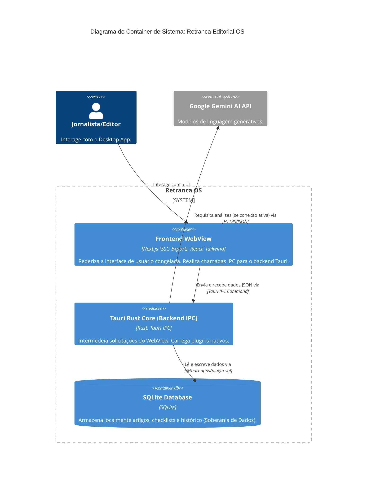

# Diagrama de Container (C4) - Retranca OS

```mermaid
C4Container
    title Diagrama de Container de Sistema: Retranca Editorial OS

    Person(editor, "Jornalista/Editor", "Interage com o Desktop App.")

    System_Boundary(c1, "Retranca OS") {
        Container(webview, "Frontend WebView", "Next.js (SSG Export), React, Tailwind", "Rederiza a interface de usuário congelada. Realiza chamadas IPC para o backend Tauri.")
        Container(tauriCore, "Tauri Rust Core (Backend IPC)", "Rust, Tauri IPC", "Intermedeia solicitações do WebView. Carrega plugins nativos.")
        ContainerDb(sqliteDb, "SQLite Database", "SQLite", "Armazena localmente artigos, checklists e histórico (Soberania de Dados).")
        
        Rel(webview, tauriCore, "Envia e recebe dados JSON via", "Tauri IPC Command")
        Rel(tauriCore, sqliteDb, "Lê e escreve dados via", "@tauri-apps/plugin-sql")
    }

    System_Ext(gemini, "Google Gemini AI API", "Modelos de linguagem generativos.")

    Rel(tauriCore, gemini, "Requisita análises (se conexão ativa) via", "HTTPS/JSON")
    Rel(editor, webview, "Interage com a UI")
```
