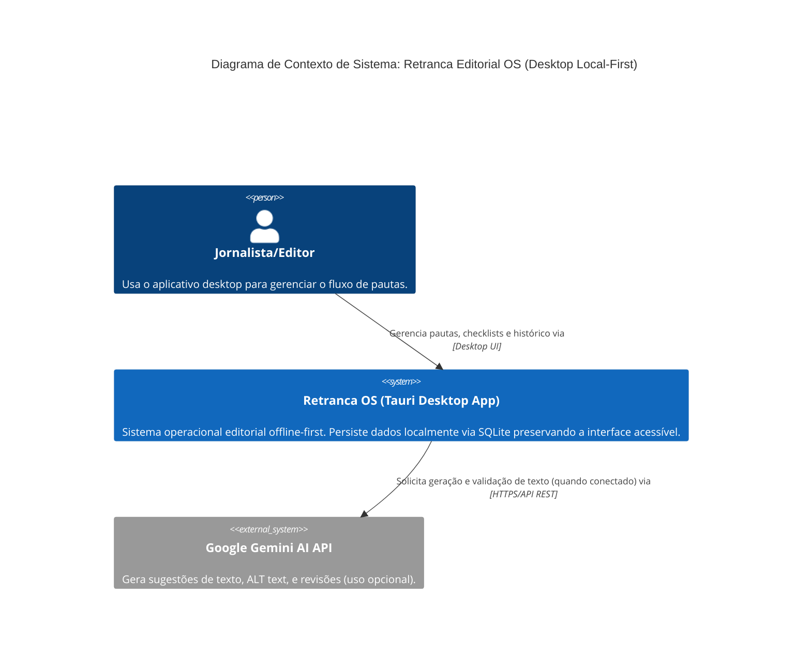

# Diagrama de Contexto (C4) - Retranca OS

```mermaid
C4Context
    title Diagrama de Contexto de Sistema: Retranca Editorial OS (Desktop Local-First)

    Person(editor, "Jornalista/Editor", "Usa o aplicativo desktop para gerenciar o fluxo de pautas.")
    
    System(retrancaOS, "Retranca OS (Tauri Desktop App)", "Sistema operacional editorial offline-first. Persiste dados localmente via SQLite preservando a interface acessível.")

    System_Ext(gemini, "Google Gemini AI API", "Gera sugestões de texto, ALT text, e revisões (uso opcional).")

    Rel(editor, retrancaOS, "Gerencia pautas, checklists e histórico via", "Desktop UI")
    Rel(retrancaOS, gemini, "Solicita geração e validação de texto (quando conectado) via", "HTTPS/API REST")
```
